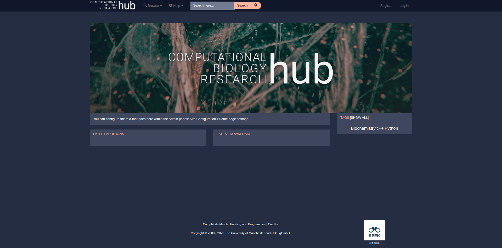

[]

    
    <h2>
Improving compmodelmatch.org @ <a href="https://github.com/nrnb">NRNB</a> 
    </h2>

	<a href="#project-details">Project Details</a> | 
	<a href="#commits-authored">Commits Authored</a> | 
	<a href="#updates">Updates</a> | 
	<a href="#to-do">To Do</a> | 
	<a href="#links">Links</a>

	Check out my <a href="https://medium.com/stray-stream/">blog</a> or follow me on <a href="https://twitter.com/sjha2048">Twitter</a> for more updates.

 

## Project Details

Compmodelmatch is the project to match researchers with different expertise, it will be used to sign up users for annual Compbio meeting and showcase publications/abstracts, as the name suggests; compmodelmatch is much more focused platform for experimentalits and modelers to connect (match) with each other, the capabilities of the platform can be best approximated by an online data management system. The data catalogue in Compmodelmatch includes raw Datasets, Abstracts, Publications and Presentations. All data are grouped by meetings/projects, and associated with the researchers who produced them. In order to encourage sharing of data we allow researchers flexibility in the formats they upload and share their data in. This means data formats in the Compmodelmatch catalogue can vary and all data is stored using versioning, selectable privacy(Sharing policies), and static URLs. Versioning and privacy settings ensure that you can share your most recent data, with who you choose. Static URLs ensure that you can be credited directly for all shared work.

There exist a few systems which can satisfy our needs, we have selected SEEK platform (Wolstencroft et al., 2015) as our base that provides the integration and interlinking of heterogeneous data sets in systems biology. The SEEK platform is used in the FAIRDOMHub public service (Wolstencroft et al., 2017) to upload and publish research assets. The SEEK platform is open-source and built using Ruby on rails. SEEK platform has well-developed data sharing policies that are upheld through assigned roles. Researchers remain in control of their own assets and can decide who to share them with, and when to publish them. External resources (such as PubMed) can be searched via the SEEK interface through available RESTful Application Programming Interfaces (APIs). Thus, users can easily create libraries of publications related to their projects. The main web user interface of SEEK allowed users to browse projects, institutions, people, publications and many other assets available. Documents can be made public or be restricted through a comprehensive permissions system that controls visibility to projects and individuals. Content is indexed on upload and available through a Solr search.

## Objectives 

- Better page design and navigation 
- Customization to serve as NRNB hub for providing expertise and requesting help
- Sign-up using social media platforms 
- Fetching user data from ORCID
- Security improvements (Configuring SSL)
- Setting up CI/CD 
- Automated Dockerhub deployments 

**Mentors**: [@vcellmike](https://github.com/vcellmike) and [@pepe454](https://github.com/pepe454)

## Commits Authored

#### On [compmodelmatch](https://github.com/pepe454/compmodelmatch)

This codebase was based on SEEK-1.7 soon we realized that SEEK-1.10 would be better suited for our requirements 

- [master](https://github.com/pepe454/CompModelMatch/commits?author=sjha2048) Branch

#### On [Seek](https://github.com/sjha2048/seek/tree/seek-1.10)

Switched to branch [SEEK-1.10] in later phase of GSoC

- [seek-1.10](https://github.com/sjha2048/seek/commits/seek-1.10?author=sjha2048) Branch

## Repository URL

[SEEK (Branch-Seek-1.10)](https://github.com/sjha2048/seek/tree/seek-1.10)

## Updates

### Community Bonding (May 4, 2020 - June 1, 2020)

we finalized the workflow and decided that vagrant will be our first choice for setting up the development enviornment

### Phase One (June 2, 2020 - June 29, 2020)

All the minor glitches and bugs on the user interface were resolved, and we started the planning for implementing the main components of compmodelmatch such as meetings, projects, instituions, publications, abstracts, etc...

### Phase Two (July 3, 2020 - July 27, 2020)

In the middle of this phase we realized that there is one more approach possible for this project, it would mean abandoning all the previous work but after couple of meetings we came to a resolution that even if we need to abandon our previous work and need to start from scratch it would be still worth it because, in exchange we are getting an advantage of better maintainability of code, we can pull new features from upstream easily and also better stability with smooth deployment.

### Phase Three (July 31, 2020 - August 24, 2020)

Our decision of starting from scratch was benefecial and we made a great amount of progress with the new codebase, in this phase we mainly focussed on getting all the main components of compmodelmatch customized according to our needs and test them for stability, also we ported all the stylesheets from our previous codebase to our new platform. 

## Deliverables 

| Tasks   | Planned | Completed     |
| :---:       |    :----:   |    :---:      |
| Meetings      | Yes       | :heavy_check_mark:   |
| Projects   | Yes        | :heavy_check_mark:      |
| User Interface Bugs| Yes | :heavy_check_mark: |
| New User Interface for Seek | Yes | :heavy_check_mark: |
| OAuth Integration  | Yes (Planned to release in v1.11) | :heavy_check_mark: |
| Github Action for Auto builds | No | :heavy_check_mark: |
| Forum | Yes (In Progress) | :no_entry_sign: |
| Setting up CI/CD | Yes | :heavy_check_mark: |

## To Do:  

- Social Login release (will be released in next version, i.e, SEEK-1.11)
- Forum for the platform based on [Discourse](https://github.com/discourse/discourse)
- Changing the role of Institutions (Future Scope)

## Blog posts 

Here are couple of blog posts which I have written between my GSoC Journey.

- GSoC 2020: Acceptance | [l’ acceptation](https://medium.com/stray-stream/gsoc-2020-acceptance-l-acceptation-f1e3003ae6cf).
- GSoC 2020: To infinity and beyond🚀 | [vers l'infini et au-delà🚀](https://medium.com/stray-stream/gsoc-2020-final-phase-vers-linfini-et-au-del%C3%A0-f57fcf306d54)

## Links

- [GSoC 2020 Proposal NRNB - sjha2048](https://docs.google.com/document/d/104erXLjouNObUAcLWz_Vva5jHKpp3zuxMAo2Ct4ZI3A/edit?usp=sharing)
- [Project Link](https://summerofcode.withgoogle.com/projects/#6091933446832128) on GSoC Website.

## Kanban Board

I used Notion to track progress of my project and also to collaborate with my mentors, I highly recommend using Notion to boost your productivity, below I have linked my kanban board for reference.

[Notion Board](https://www.notion.so/d3f303ea518b4360b2a9b0c2591aa598?v=ea84b199cb1b4ef2ba55377f4545080d)

## Future Scope 

- Getting rid of default behaviour of Institutions 
- Removal of stale and unnecessary code
- Increasing unit test coverage
- Refine User Interface by making it more compact
- Optimize the platform for mobile

## Key Learnings 

- Gained major insight of software development lifecycle (Agile Methodolgy)
- Importance of CI/CD and Unit tests 
- An amazing framework; Ruby on Rails 
- Major concepts of OOPs like abstraction and Inheritance  
- Imporoved my collaboration and communication skills 

## Final Result

[compmodelmatch.org](http://compmodelmatch.org/)

## Footnotes

- We have weekly meetings over google meet on every monday at 10am EST 
- I will update the blog post section every week when the coding peroid starts
- Project progress is being monitored on a Notion Kanban board, I will update the link of the board when coding period is over 

